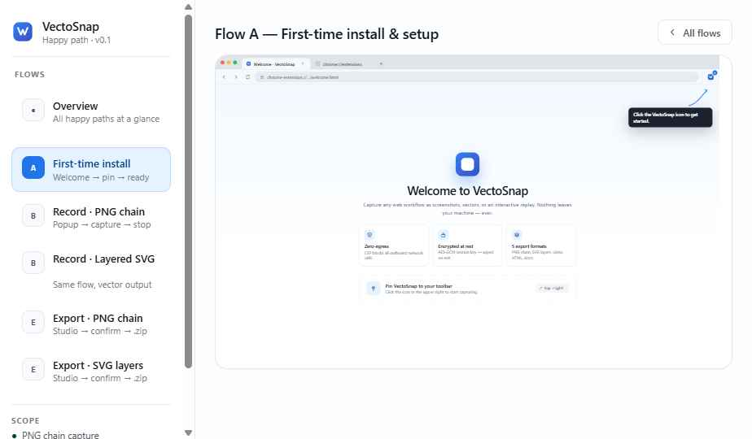

# ToyoSnap: Secure Workflow Capture for the Modern Enterprise
**Internal Presentation & Executive Pitch**
**Target Audience:** Instructional Design Leads, InfoSec Officers, L&D Directors

---

## Slide 1: Title Slide
*   **Headline:** ToyoSnap: Zero-Egress Workflow Capture
*   **Sub-headline:** Eliminating the Friction Between Instructional Design and Information Security.
*   **Visual Suggestion:** Clean, high-contrast logo or a stylized browser window icon.
*   **Image:** 
*   **Speaker Notes:** "Good morning. Today we’re discussing ToyoSnap—a solution specifically engineered for our Instructional Design team that solves one of our biggest bottlenecks: capturing high-quality workflow data without compromising our enterprise security posture."

---

## Slide 2: The Challenge: Security vs. Agility
*   **Visual Suggestion:** A split screen. Left side: "Efficiency Needs" (Fast capture, auto-documentation). Right side: "Security Constraints" (Data privacy, cloud bans, PII risk).
*   **Image:** 
*   **Key Points:**
    *   Traditional tools require cloud uploads (violation of policy).
    *   InfoSec blocks modern capture suites due to data egress.
    *   Manual documentation is the #1 time-sink for Instructional Designers.
*   **Speaker Notes:** "Currently, our IDs spend significant time manually taking screenshots and writing guides. Most modern tools that automate this are rejected because they send data to third-party clouds. We’ve been forced to choose between being slow or being insecure. ToyoSnap removes that choice."

---

## Slide 3: The Solution: ToyoSnap
*   **Headline:** The Zero-Egress Capture Engine
*   **Visual Suggestion:** A diagram showing a laptop with a circular "Privacy Bubble" around it. Arrows point from the browser to local files, with a "Blocked" sign toward the Internet.
*   **Key Definition:** 
    *   **Zero-Egress:** No data ever leaves the local machine.
    *   **Local-First Architecture:** Processing, encryption, and export happen entirely in the browser memory.
*   **Speaker Notes:** "ToyoSnap is a Zero-Egress browser extension. Unlike other tools, it is built on a 'Hard-Security' constraint: it has no server. Your recordings, screenshots, and PII-sensitive data never touch a cloud—they stay in your local browser instance until you choose to export them."

---

## Slide 4: Capture Capabilities
*   **Headline:** One Recording, Infinite Possibilities
*   **Visual Suggestion:** Icons for Video (WebM), SVG (Vector), PNG (Images), and HTML (Replay).
*   **Features:**
    *   **Video Capture:** High-quality recording.
    *   **Layered SVGs:** Vector-based captures editable in Illustrator/Figma.
    *   **Image Chains:** Automatic ZIP of every click-based screenshot.
    *   **Interactive Replay:** Self-contained players for web-based training.
*   **Speaker Notes:** "We don't just capture video. For our designers, the 'Layered SVG' mode is a game changer—it captures the actual UI elements as vectors, allowing us to edit labels or buttons directly in our design tools without re-recording."

---

## Slide 5: The Studio: Built-in PII Protection
*   **Headline:** Redaction as a First-Class Citizen
*   **Visual Suggestion:** A mockup of the ToyoSnap Studio showing 'Blur' and 'Pixelate' tools in action over a sensitive form.
*   **Benefits:**
    *   Blur sensitive data (Names, SSNs, CCs) before export.
    *   Selector-based redaction: Hide an element across every step with one click.
    *   Audit Ledger: Every change is tracked locally for quality control.
*   **Speaker Notes:** "Before any export leaves the designer's machine, they can enter the ToyoSnap Studio. Here, they can blur or pixelate sensitive PII. This ensures that the training materials we distribute are compliant with our internal privacy standards from the moment of creation."

---

## Slide 6: Enterprise-Grade Security
*   **Headline:** Built for InfoSec Approval
*   **Visual Suggestion:** Checklist with "Pass" icons next to technical standards.
*   **Technical Proofs:**
    *   **Manifest V3:** The latest, most secure Chrome extension standard.
    *   **IDB Encryption:** Data at rest is encrypted via AES-GCM 256-bit.
    *   **Strict CSP:** 'connect-src: self' — mathematically impossible to send data to external APIs.
    *   **No API Keys/Secrets:** Zero external dependencies.
*   **Speaker Notes:** "For our InfoSec partners: ToyoSnap was built with your audit checklist in hand. It uses AES-GCM 256-bit encryption for local storage, and its Content Security Policy is locked down so tightly that it physically cannot communicate with the outside world."

---

## Slide 7: Auto-Generated Documentation
*   **Headline:** Documentation at the Speed of Thought
*   **Visual Suggestion:** A capture turning into a PPTX and a DOCX file icon.
*   **Export Formats:**
    *   **Executive Decks:** Auto-generated PPTX.
    *   **Technical Manuals:** Structured DOCX and Markdown.
    *   **Design Systems:** JSON/MCP logs for developer handoff.
*   **Speaker Notes:** "The real ROI is in the export. Once a workflow is captured, ToyoSnap can automatically generate a PowerPoint deck or a Word manual. What used to take hours of formatting now takes seconds."

---

## Slide 8: The ROI: Quantifying the Value
*   **Headline:** Efficiency Gains
*   **Visual Suggestion:** A bar chart comparing "Manual Documentation" (High) vs "ToyoSnap Workflow" (Low).
*   **Impact:**
    *   **Estimated 60% reduction** in manual documentation time.
    *   **0% data egress risk** (Zero liability).
    *   **High-Fidelity Assets:** No more blurry screenshots; crisp vectors for every step.
*   **Speaker Notes:** "By adopting ToyoSnap, we expect to see a 60% reduction in the time it takes to produce technical training materials. More importantly, we eliminate the liability of designers accidentally uploading sensitive company workflows to cloud-based tools."

---

## Slide 9: Implementation Roadmap
*   **Headline:** Low Friction, High Impact
*   **Visual Suggestion:** A 3-step timeline: 1. Unpacked Load (Pilot) -> 2. InfoSec Audit -> 3. Internal Registry Deployment.
*   **Timeline:**
    *   **Phase 1:** Designer Pilot (Ready).
    *   **Phase 2:** Security Evidence Package Review.
    *   **Phase 3:** Full Team Onboarding.
*   **Speaker Notes:** "We are ready to move from pilot to audit. The tool is fully functional, and we have a complete 'InfoSec Evidence Package' ready for review. We’re looking for your approval to proceed to the internal registry deployment."

---

## Slide 10: Conclusion & Call to Action
*   **Headline:** Secure. Fast. Local.
*   **Visual Suggestion:** Final ToyoSnap branding and team contact info.
*   **CTA:** 
    *   Request: Approval for a 30-day InfoSec sandbox review.
    *   Offer: Live demo for the security team.
*   **Speaker Notes:** "In conclusion, ToyoSnap gives us the 'Superpowers' of modern capture tools without the 'Vulnerabilities' of the cloud. Let’s bring our instructional design workflow into 2026 securely. Any questions?"
